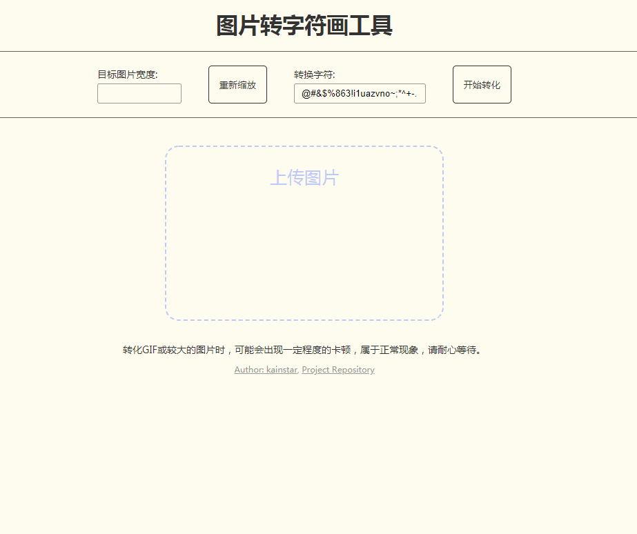
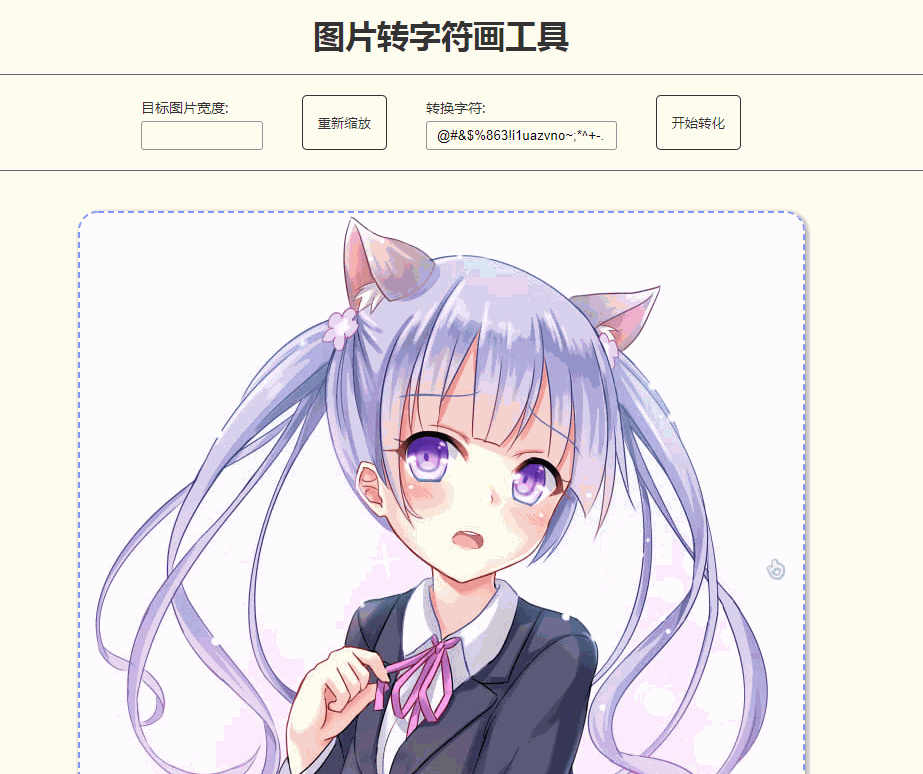

# image-to-text

一个纯前端的图片转字符画工具

[仓库地址](https://github.com/kainstar/image-to-text)

[项目地址](https://blog.kainstar.moe/image-to-text/)

## 项目说明

- 纯前端项目，不依赖服务器
- 支持 jpg，png，gif 三种格式图片
- 使用 canvas 来实现单帧图片的解析、缩放和生成，使用gif.js合并单帧图片为gif图片
- 可等比缩放图片
- 可自定义文字和背景颜色
- 可自定义转换时使用的字符
- 部分方法实现参考已在源码中标明出处

## 项目使用技术栈

- webpack
- React
- gif.js （生成gif图片用）

## 项目结构

```
├─ src
│   ├─ component 组件文件
│   ├─ style 样式文件
│   ├─ tools 图片解析、转化工具文件
│   ├─ App.jsx
│   ├─ index.js
│   └─ index.html
├─ static
│   └─ js
│       └─ gif.worker.js gif.js生成图片依赖文件
├─ webpack
│    └─ webpack 配置文件
└ 其他文件
```

## 效果演示

### 基本功能



### 图片大小缩放


### 设置颜色（文字和背景）


### 自定义转换字符



## 本地运行

### 开发模式

```bash
npm i
npm run dev
```

### 项目打包

```bash
npm run build
```

### 发布到github pages

```bash
npm run deploy
```
